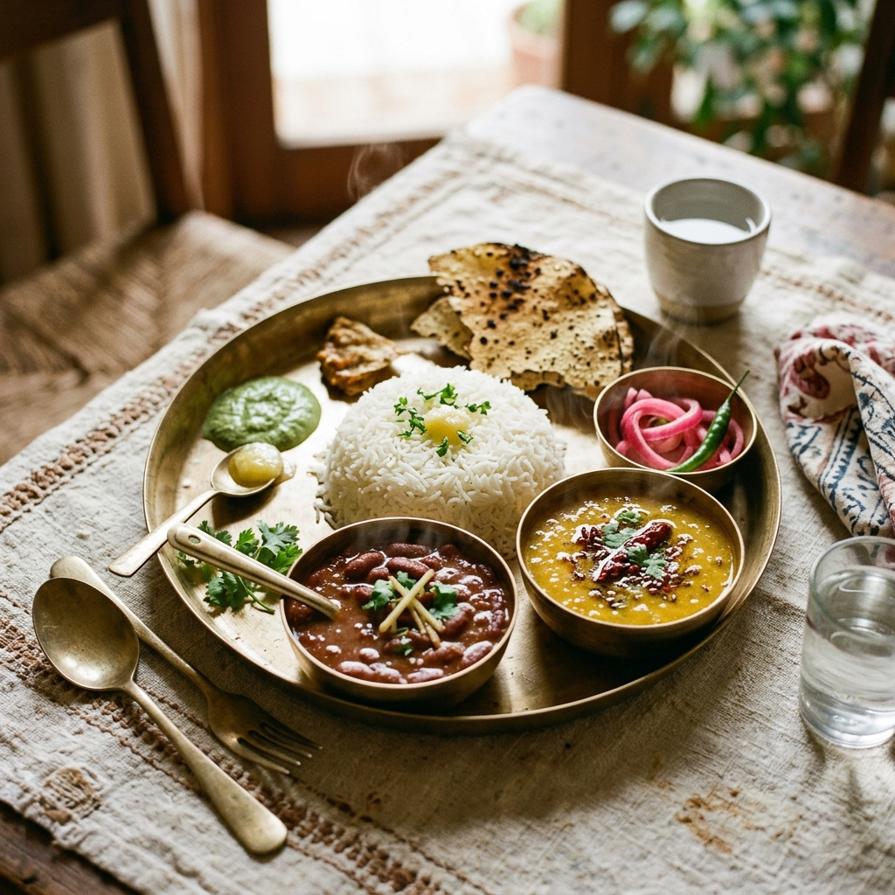
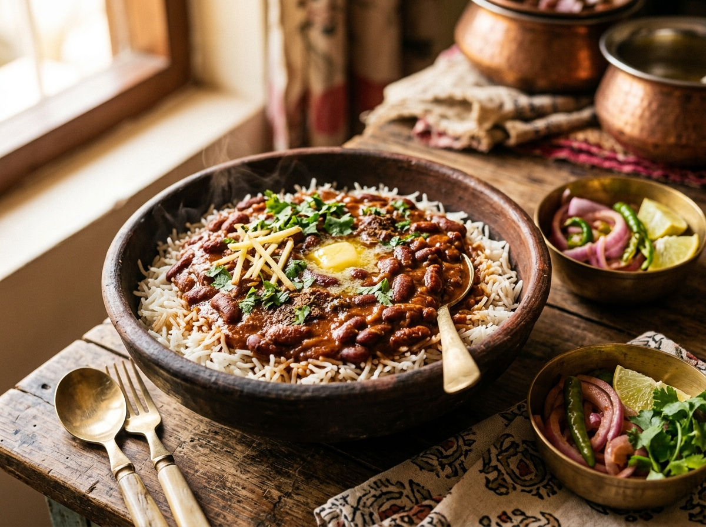
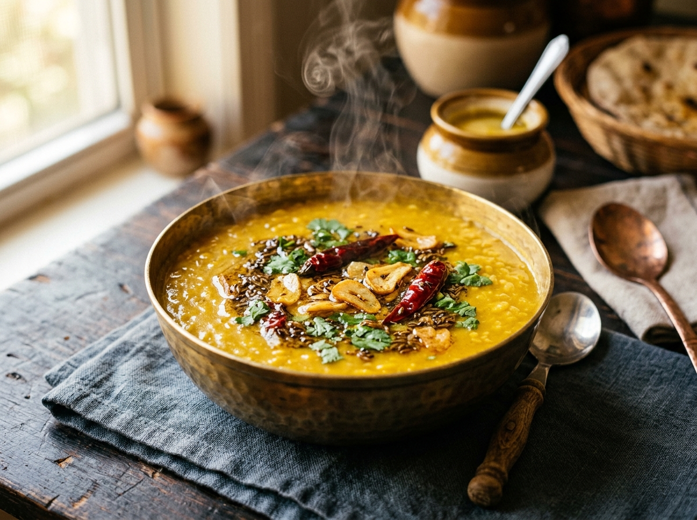
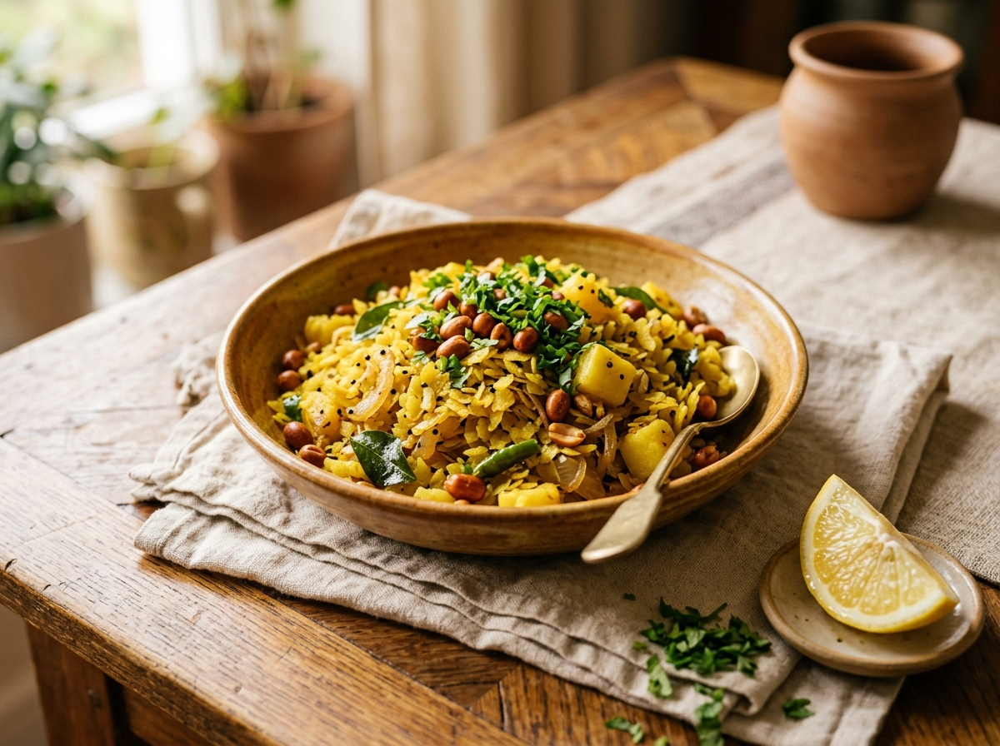
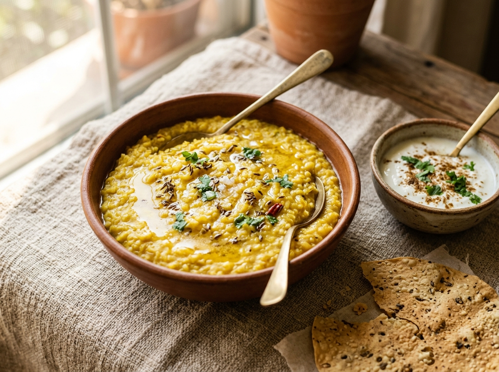
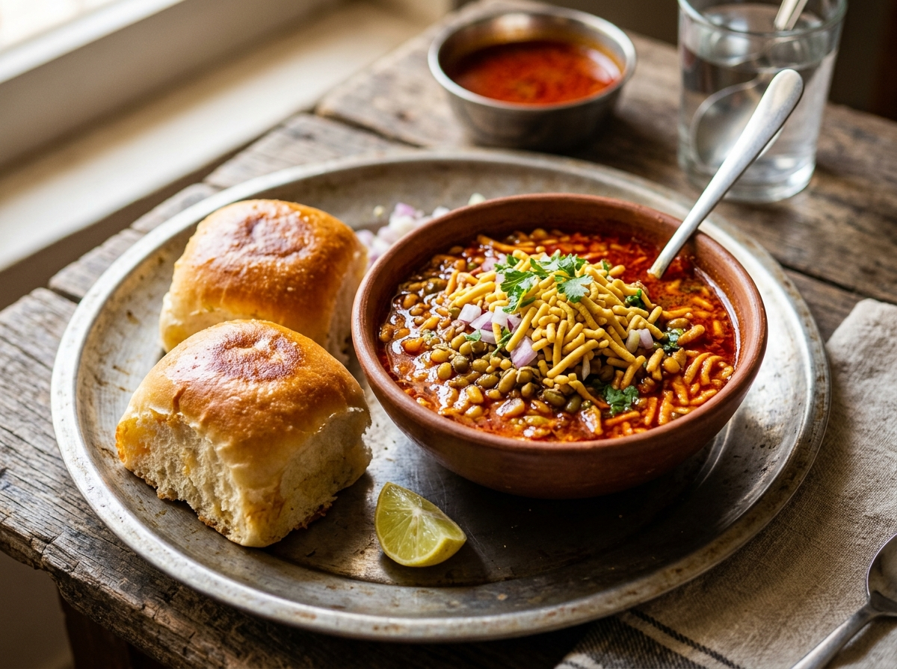
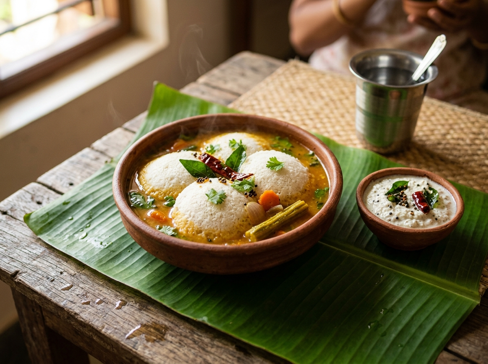
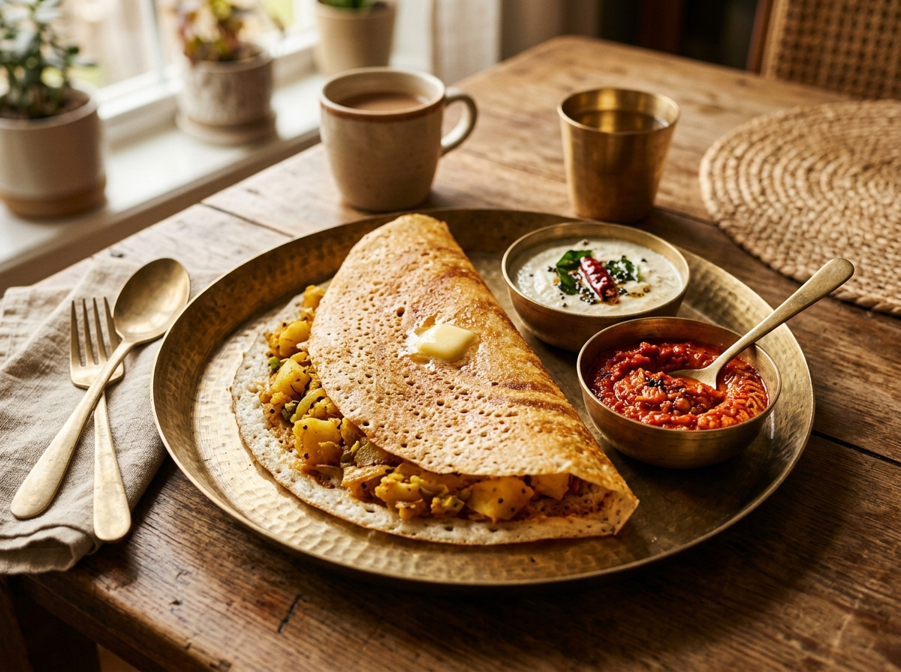
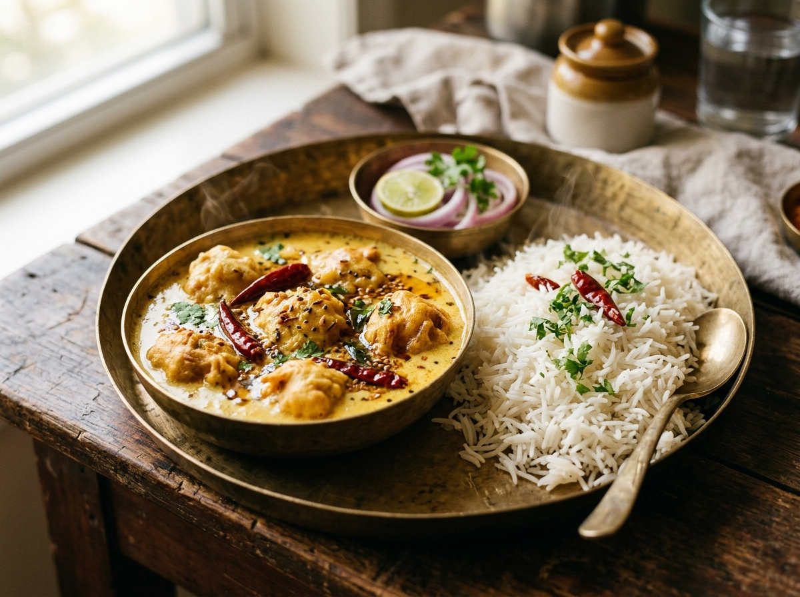

# 🍲 Ghar Ka Swad (घर का स्वाद) — A Taste That Feels Like Home

<div align="center">


<br />

### *"Some meals don’t just feed you. They bring you home."*

An award-winning, interactive digital editorial experience celebrating the timeless comfort foods, regional philosophies, sacred spices, and generational memories of India.

<br />



</div>

---

## 📖 Table of Contents

- [🌟 Project Vision & Philosophy](#-project-vision--philosophy)
- [🗺️ System Architecture & User Journey Flowchart](#️-system-architecture--user-journey-flowchart)
- [✨ Key Features & Interactive Modules](#-key-features--interactive-modules)
  - [1. Hero Experience (The First 3 Seconds)](#1-hero-experience-the-first-3-seconds)
  - [2. Comfort Discovery Questionnaire](#2-comfort-discovery-questionnaire)
  - [3. Eight Signature Comfort Food Traditions](#3-eight-signature-comfort-food-traditions)
  - [4. Surprise Me Comfort Oracle](#4-surprise-me-comfort-oracle)
  - [5. Interactive India Journey & Cartography](#5-interactive-india-journey--cartography)
  - [6. Featured Recipe & Full-View Cook Mode](#6-featured-recipe--full-view-cook-mode)
  - [7. Botanical Ingredient Constellation](#7-botanical-ingredient-constellation)
  - [8. The Community Memory Wall](#8-the-community-memory-wall)
  - [9. Heirloom Recipe Card Generator & Print Suite](#9-heirloom-recipe-card-generator--print-suite)
  - [10. The Climax & Interactive Plate Drawer](#10-the-climax--interactive-plate-drawer)
- [🎨 Design Tokens & Editorial Typography](#-design-tokens--editorial-typography)
- [♿ Accessibility & Performance Standards](#-accessibility--performance-standards)
- [📂 Codebase Structure](#-codebase-structure)
- [🚀 Getting Started & Local Development](#-getting-started--local-development)
- [📜 License](#-license)

---

## 🌟 Project Vision & Philosophy

Built for the **DEV Community Frontend Challenge: Comfort Food Edition**, **Ghar Ka Swad** moves deliberately away from generic restaurant templates, commercial food delivery UIs, and stock-photo catalogs.

Instead, it acts as an **interactive editorial tribute**:
$$\text{Indian Comfort Food} \longrightarrow \text{Memory} \longrightarrow \text{Culture} \longrightarrow \text{Emotion} \longrightarrow \text{Home}$$

### The 70/30 Visual Architecture
* **70% Heritage SVG Craftsmanship**: Handcrafted vector animations, rising steam paths, floating spice motes, deterministic spice constellations, and custom regional cartography.
* **30% Authentic Home-Style Photography**: Warm, natural daylight photography captured in brass thalis, rustic clay katoris, and banana leaves—instantly connecting the viewer's senses to the kitchen.

---

## 🗺️ System Architecture & User Journey Flowchart

```mermaid
flowchart TD
    A[Visitor Enters Ghar Ka Swad] --> B[Hero: First-3-Seconds Visual Anchor & Time Greeting]
    
    B --> C[Comfort Discovery: What feels like home to you?]
    C -->|Select Emotion| C1[Dynamic Soul Match & Recommendation]
    
    B --> D[Explore Eight Signature Comfort Food Traditions]
    D --> D1[Inline Story & Serving Ritual Expansion]
    D --> D2[Add Dish to Comfort Plate]
    
    B --> E[Surprise Me Comfort Oracle]
    E -->|Randomized Hearth Roll| E1[Reveal Surprise Tradition]
    
    B --> F[India Journey: Regional SVG Cartography]
    F -->|Select Zone: North/West/South/East/Northeast| F1[Update Regional Lore, Flavors & Food Photography]
    
    B --> G[Featured Recipe: Rajma Chawal Ritual]
    G --> G1[Scroll-Driven 5-Step Narrative]
    G --> G2[Launch Distraction-Free Full-View Cook Mode]
    G2 --> G3[Keyboard Step Controls Arrow Keys + ESC + Kitchen Timer]
    
    B --> H[Botanical Ingredient Constellation]
    H -->|Focus/Click Spice Node| H1[Highlight Connected Dishes & Culinary Alchemy]
    
    B --> I[The Community Memory Wall]
    I --> I1[Read Postcards with Curated Starters]
    I --> I2[Submit New Memory with Instant LocalStorage Optimistic Update]
    
    B --> J[Heirloom Family Recipe Card Generator]
    J --> J1[Fill Dish Name, Cook & Secret Ingredient]
    J --> J2[Dedicated Print Stylesheet window.print]
    
    B --> K[Climax & Interactive Comfort Plate]
    K --> K1[Dynamic Thali Assembly]
    K --> K2[Open Slide-Over Plate Drawer]
    K2 --> K3[Calculate Derived Comfort Persona useComfortPersona]
    K2 --> K4[Web Share API / Clipboard Copy Fallback]
```



---

## ✨ Key Features & Interactive Modules

### 1. Hero Experience (The First 3 Seconds)
* **Visual Lockup**: An Indian brass thali with simmering rajma, yellow dal tadka, aged basmati rice, sirka onions, and crispy papad.
* **Ambient Motion**: Rising SVG steam paths rendered with Framer Motion, drifting golden spice motes, and ambient depth lighting.
* **Editorial Typography**: Cormorant Garamond display serif headline with real-time local time-of-day greeting badge (*Morning, Afternoon, Evening, Midnight*).

<div align="center">


</div>

---

### 2. Comfort Discovery Questionnaire
* Five emotional prompts:
  * ☀️ *Something warm & soothing* $\rightarrow$ Moong Dal Ghee Khichdi
  * 🔥 *Something fiery & bold* $\rightarrow$ Kolhapuri Misal Pav
  * ✨ *Something crispy & buttery* $\rightarrow$ MTR Butter Masala Dosa
  * ❤️ *Something nostalgic & comforting* $\rightarrow$ Dhaba-Style Rajma Chawal
  * ☕ *Something my family made at dawn* $\rightarrow$ Kanda Batata Poha
* Instant inline reveal with emotional story excerpts, flavor profiles, and single-click plate addition.

---

### 3. Eight Signature Comfort Food Traditions
Covers the quintessential pan-Indian comfort repertoire:
1. **Kanda Batata Poha** (Maharashtra & Madhya Pradesh)
2. **Dhaba-Style Rajma Chawal** (Punjab & North India)
3. **Moong Dal Ghee Khichdi** (Pan-India & Gujarat)
4. **Kolhapuri Misal Pav** (Maharashtra)
5. **Dhaba Style Dal Tadka** (Uttar Pradesh & North India)
6. **Steaming Idli & Filter Coffee Sambhar** (Tamil Nadu & Karnataka)
7. **Amritsari Kadhi Pakora** (Punjab & Rajasthan)
8. **MTR Butter Masala Dosa** (Karnataka & South India)

Each card features:
* Dedicated `4:3` food photography with regional badge overlay
* Reusable circular SVG `<ComfortScore />` radial meter with factor breakdown tooltip (*Nostalgia, Warmth, Familiarity, Family factor*)
* Inline **"Story & Ritual"** expansion toggle without modal interruptions

<div align="center">



</div>

---

### 4. Surprise Me Comfort Oracle
An interactive culinary oracle that consults grandmother's hearth to randomly suggest a traditional dish with its score, emotional origin, and one-click plate addition.

---

### 5. Interactive India Journey & Cartography
* **Stylized Vector Map**: Custom, hand-crafted SVG map of India featuring regional hubs (*North, West, South, East, Northeast*).
* **Keyboard Accessible**: Pins are fully focusable with high-visibility rings (`Tab`, `Enter`, `Space`).
* **Atmosphere Transition**: Selecting a zone seamlessly switches regional storytelling, hospitality lore, signature flavor palettes, and regional food photography.

<div align="center">


</div>

---

### 6. Featured Recipe & Full-View Cook Mode
* **The Sunday Rajma Chawal Ritual**: 5 scroll-driven steps (*01 The Overnight Soak, 02 The Pressure Whistle, 03 Building the Soulful Masala, 04 The Slow Gentle Simmer, 05 Serving the Steaming Thali*).
* **Full-View Cook Mode**:
  * Distraction-free high-contrast full-screen view (no modal focus trap issues)
  * Keyboard navigation: `ArrowRight` (Next), `ArrowLeft` (Previous), `Escape` (Exit)
  * Integrated interactive kitchen timer widget (Play/Pause/Reset)
  * Large-print typography, sensory check callouts, and grandmother's golden advice

---

### 7. Botanical Ingredient Constellation
* A deterministic, pre-computed SVG node network connecting 8 core Indian spices (*Turmeric, Pure Desi Ghee, Cumin Seeds, Fresh Curry Leaves, Ginger, Mustard Seeds, Kashmiri Chili, Green Cardamom*) to classic comfort dishes.
* Fully keyboard accessible with focus states and culinary chemistry descriptions.

---

### 8. The Community Memory Wall
* Vintage postcard gallery featuring genuine memories of grandmother's kitchen, monsoon train journeys, and college canteen mornings.
* **Zero Empty State**: Comes pre-populated with warm starter memories.
* **Interactive Dialog**: "Leave Your Memory" form composing the accessible `Dialog.tsx` primitive, persisting immediately to `localStorage` with optimistic UI updates.

---

### 9. Heirloom Recipe Card Generator & Print Suite
* Allows visitors to immortalize their family's secret recipes (*Dish Name, Master Cook, Secret Ingredient, Cherished Memory*).
* Live vintage card preview with integrated `@media print` CSS stylesheet for printing physical heirloom recipe cards.

---

### 10. The Climax & Interactive Plate Drawer
* **Climax Manifesto**: *"Maybe home was never a place. Maybe it was always the food waiting for you."*
* **Dynamic Plate Visualization**: Renders an assembled thali reflecting all dishes chosen during the visitor's journey.
* **Slide-Over Drawer (`ComfortPlateDrawer.tsx`)**:
  * Displays total comfort score and dish thumbnails
  * Computes derived user comfort archetype via `useComfortPersona` (*e.g., "The Nostalgic Sunday Soul", "The Fiery Street Romantic", "The Soulful Healer"*)
  * Native Web Share API integration with automatic fallback to clipboard copy and toast confirmation

<div align="center">

</div>

---

## 🎨 Design Tokens & Editorial Typography

### Centralized Color Palette

| Token Name | Hex Code | Semantic Role |
| :--- | :--- | :--- |
| **Parchment Background** | `#F8F4EE` | Warm antique paper background canvas |
| **Surface Ivory** | `#FFFDF9` | Card and interactive surface backdrop |
| **Charcoal Primary** | `#1E1B18` | Deep umber text for maximum legibility |
| **Muted Slate** | `#635E59` | WCAG AA compliant secondary metadata text |
| **Terracotta Saffron** | `#C56A2D` | Primary warmth, buttons, active highlights |
| **Turmeric Gold** | `#D8A24A` | Accent glows, star badges, comforting arcs |
| **Curry Leaf Olive** | `#6E7A52` | Earthy badges, herbs, success states |
| **Woven Linen** | `#E7DFD3` | Delicate card borders and dividers |

### Typography System
* **Editorial Display & Headings**: `Cormorant Garamond` (Weights: 400, 500, 600, 700, Italic)
* **UI, Metadata & Body**: `Inter` (Weights: 300, 400, 500, 600, 700)

---

## ♿ Accessibility & Performance Standards

### Accessibility (WCAG AA Compliant)
- [x] **Full Keyboard Traversal**: Every interactive button, pill, card toggle, map pin, constellation node, and cook mode control is fully navigable via `Tab`, `Shift+Tab`, `Enter`, `Space`, `Arrow Keys`, and `Escape`.
- [x] **Unified Dialog Primitive (`Dialog.tsx`)**: Centralizes focus management, focus trapping, scroll locking, and focus restoration upon dismissal.
- [x] **Visible Focus Rings**: High-contrast rings on all interactive elements (`focus-visible:ring-2 focus-visible:ring-saffron`).
- [x] **Descriptive Media Alt Text**: Meaningful descriptions for every food photograph.
- [x] **Full Reduced Motion Support**: Listens to `prefers-reduced-motion: reduce`, automatically destroying Lenis smooth scroll and disabling all decorative steam and particle animations.

### Performance Optimization
- [x] **Asset Optimization**: Responsive WebP/JPEG assets pre-compressed under 150KB.
- [x] **Lazy Loading**: `loading="lazy"` on all below-the-fold assets; eager loading for the critical Hero visual.
- [x] **Zero Cumulative Layout Shift (CLS = 0)**: Explicit aspect ratio containers on all image wrappers.
- [x] **Clean Production Bundle**: Built with Vite and Rollup with zero unnecessary physics/canvas particle libraries.

---

## 📂 Codebase Structure

```text
src/
├── types/
│   └── index.ts                  # Centralized TypeScript interfaces
├── data/
│   ├── dishes.ts                 # 8 Iconic Indian comfort dishes & metadata
│   ├── regions.ts                # 5 Regional culinary zones
│   ├── ingredients.ts            # 8 Core Indian aromatics with coordinates
│   ├── memories.ts               # Curated starter community memories
│   ├── discovery.ts              # Mood prompts & mapped dish algorithms
│   ├── featuredRecipe.ts         # Rajma Chawal 5-step preparation lore
│   └── foodImages.ts             # Centralized image metadata & alt text registry
├── context/
│   └── ComfortPlateContext.tsx   # Lean plate state & drawer dispatchers
├── hooks/
│   ├── useTimeOfDay.ts           # Browser local time greeting
│   ├── useReducedMotion.ts       # prefers-reduced-motion media query listener
│   ├── useLocalStorage.ts        # Resilient storage hook with memory failover
│   └── useComfortPersona.ts      # Pure derived persona archetype hook
├── components/
│   ├── common/
│   │   ├── Navbar.tsx            # Sticky header, time badge, plate counter
│   │   ├── Footer.tsx            # Editorial colophon & accessibility notes
│   │   ├── ComfortScore.tsx      # Reusable SVG radial meter & factor tooltip
│   │   ├── Dialog.tsx            # Centralized accessible dialog primitive
│   │   ├── FoodImage.tsx         # Reusable responsive image with fallback
│   │   ├── SteamEffect.tsx       # Animated SVG steam paths
│   │   └── SectionHeading.tsx    # Standardized editorial title lockup
│   ├── hero/
│   │   ├── Hero.tsx              # First-3-seconds visual & typography
│   │   └── HeroArtComposition.tsx# Brass thali composition & steam
│   ├── discovery/
│   │   └── ComfortDiscovery.tsx  # Mood questionnaire & soul match
│   ├── dishes/
│   │   ├── FoodCards.tsx         # Regional filter tabs & card grid
│   │   └── FoodCardItem.tsx      # Card with photo, score & inline expansion
│   ├── journey/
│   │   ├── IndiaJourney.tsx      # Regional storytelling controller
│   │   └── IndiaMapSvg.tsx       # Custom stylized interactive SVG map
│   ├── recipe/
│   │   ├── RecipeExperience.tsx  # Scroll timeline & hero photo
│   │   └── CookMode.tsx          # Full-view distraction-free mode + timer
│   ├── plate/
│   │   ├── FinalCTA.tsx          # Climax quote & assembled plate
│   │   ├── InteractivePlateView.tsx # Dynamic thali assembly
│   │   └── ComfortPlateDrawer.tsx# Slide-over drawer with share/copy
│   ├── memories/
│   │   ├── MemoryWall.tsx        # Postcard memory grid
│   │   └── LeaveMemoryDialog.tsx # Accessible memory submission form
│   └── stretch/
│       ├── IngredientConstellation.tsx # Deterministic SVG spice network
│       ├── FamilyRecipeCard.tsx  # Heirloom card generator + print CSS
│       └── SurpriseMeOracle.tsx  # Randomized comfort selector
└── App.tsx                       # Lenis smooth scroll & narrative assembly
```

---

## 🚀 Getting Started & Local Development

### Prerequisites
- Node.js (v18.0 or later)
- npm or yarn

### Installation

1. **Clone the repository**:
   ```bash
   git clone https://github.com/deepbisen-06/ghar-ka-swad.git
   cd ghar-ka-swad
   ```

2. **Install dependencies**:
   ```bash
   npm install
   ```

3. **Start development server**:
   ```bash
   npm run dev
   ```
   Open [http://localhost:5173](http://localhost:5173) in your browser.

4. **Build for production**:
   ```bash
   npm run build
   ```

5. **Preview production build**:
   ```bash
   npm run preview
   ```

---

## 📜 License

Created with ❤️ and pure desi ghee for the **DEV Community Frontend Challenge: Comfort Food Edition**.  
Distributed under the MIT License.
